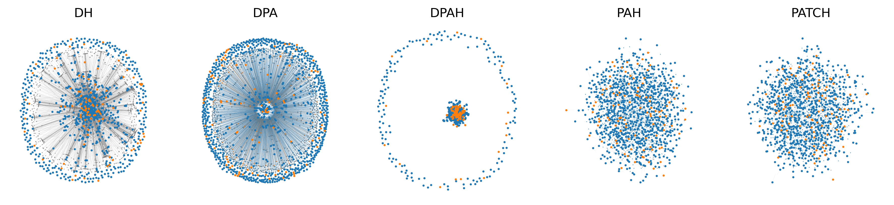
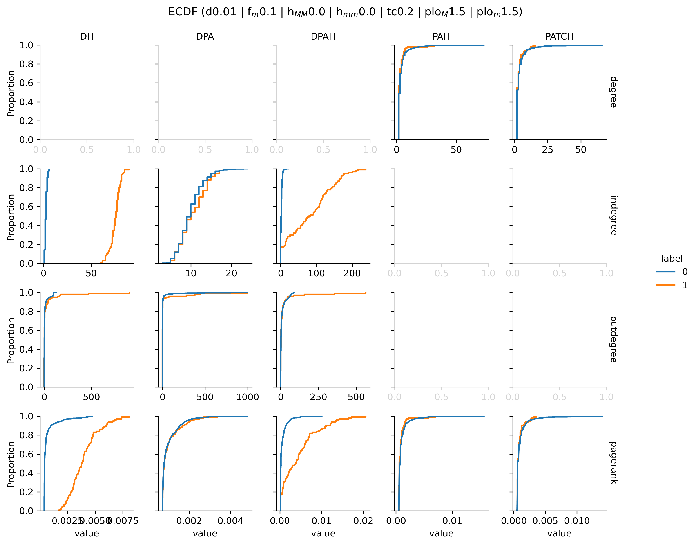
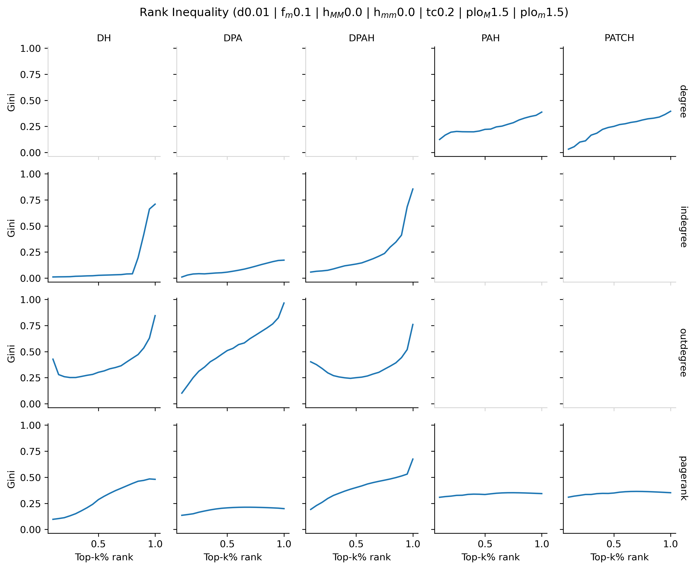
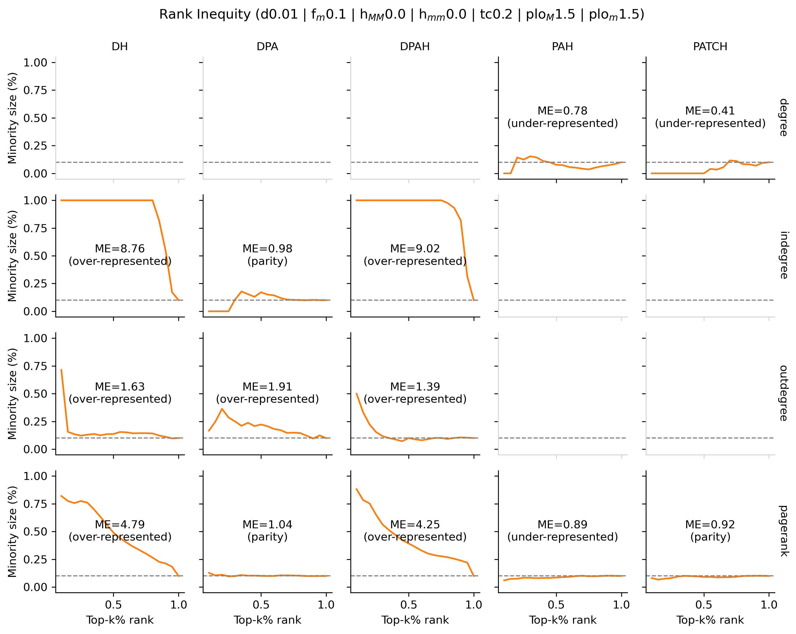

# Network Inequalities
We propose random scale-free graph generators to study network inequalities both in data and in algorithms

1. **PAH**: Undirected Network with **P**referential **A**ttachment and **H**omophily 
2. **PATCH**: Undirected Network with **P**referential **A**ttachment, **T**riadic **C**losure, and **H**omophily 
3. **DPAH**: **D**irected Network with **P**referential **A**ttachment and **H**omophily 
4. **DPA**: **D**irected Network with **P**referential **A**ttachment
5. **DH**: **D**irected Network with **H**omophily 

## License
 This work is licensed under a <a rel="license" href="http://creativecommons.org/licenses/by-nc-sa/4.0/">Creative Commons Attribution-NonCommercial-ShareAlike 4.0 International License</a>.