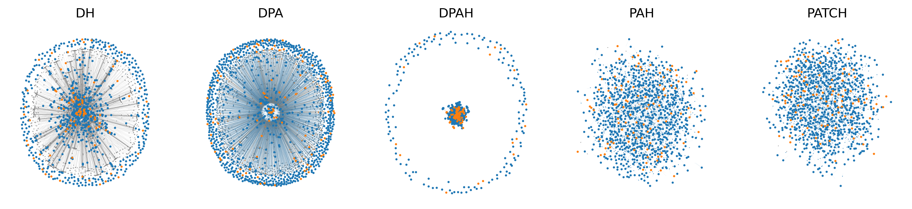
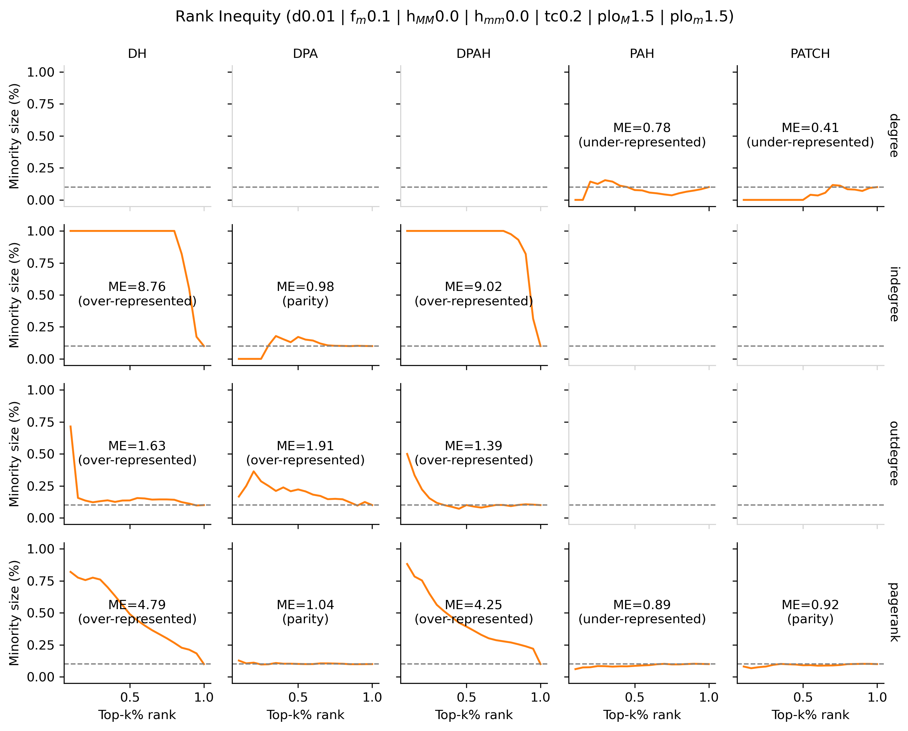

# ScaleFreeNetworks
Random scale-free graph generators proposed by members of the CSH

1. **PAH**: Undirected Network with **P**referential **A**ttachment and **H**omophily 
1. **PATCH**: Undirected Network with **P**referential **A**ttachment, **T**riadic **C**losure, and **H**omophily 
1. **DPAH**: **D**irected Network with **P**referential **A**ttachment and **H**omophily 
1. **DPA**: **D**irected Network with **P**referential **A**ttachment
1. **DH**: **D**irected Network with **H**omophily 

